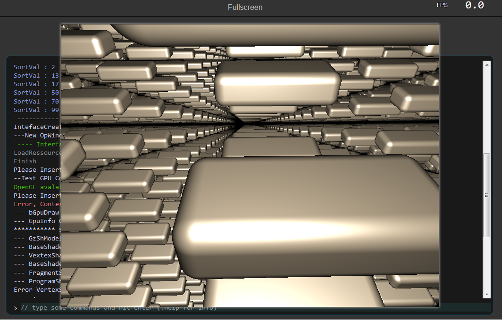

# WebRT
Export your project to the Web

This is a Back-end compiler toolchain (base on Emscripten) designed to work with [Cwc](https://github.com/VLiance/Cwc)

Use the  **"-{wToolchain}= VLianceTool/WebRT"** command-line to automatically download/use this toolchain

# Example

## Raymarching with GZE

## Particularity

Cwc load arguments xml file in the 'cwc' forlder: [Default.cwfg](https://github.com/VLianceTool/WebRT/blob/master/cwc/WebRT.Default.cwcfg) (by default)

### *"Preload"* node:
All config is generated without modifing your [environment variable](https://www.computerhope.com/issues/ch000549.htm), this will perform compilation in a more portable way

For this Cwc will load all base directory with [CreateConfig.exe](https://github.com/VLianceTool/WebRT/blob/master/wPlatform/CreateConfig.exe) and this one will generate the Emsc.cfg (first time only).

### *"ViewIn"* node:
Cwc get all available browser with [GetBrowsers.exe](https://github.com/VLianceTool/WebRT/blob/master/wPlatform/GetBrowsers.exe), choose your prefered one to test the project.

### *"Finally_CopyFolder"* node:
Custom Html shell is used to show your project, it require some css & js files, all content of the folder will be copied at end of compilation. Of Course you can use your own shell by modifing the **vWebRT_Shell** variable.

